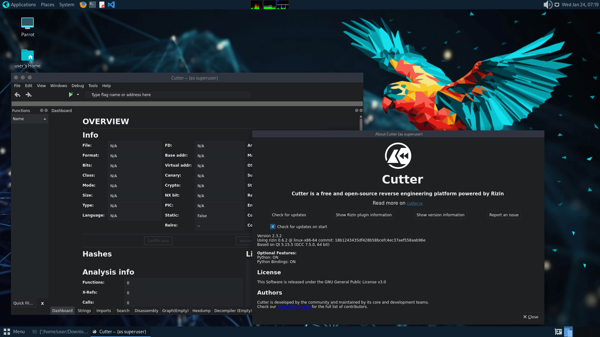

# Parrot Security
               
 -> system for Developers     | 

               
 -> system for Hackers        | 

               
 -> system for Sysadmins      | 

               
 -> system for Network enginee| 

The ultimate framework for your Cyber Security operations

<a href="https://parrotsec.org/download/">Download</a> | <a href="https://parrotsec.org/docs/introduction/what-is-parrot">Get started</a> | <a href="https://parrotsec.org/blog/2025-01-31-parrot-6.3-release-notes">ParrotOS 6.3 has been released !</a>

Tools for every operation

 

Choose between 600+ tools for every kind of Red and Blue team operation.

 

Parrot Security provides a huge arsenal of tools, utilities and libraries that IT and security professionals can use to test and assess the security of their assets in a reliable, compliant and reproducible way. From information gathering to the final report. The Parrot system gets you covered with the most flexible environment.

Explore over 600+ tools

<a href="https://parrotsec.org/docs/">Documentation</a>

`System Security`
The system is designed from the ground up to be secure. Native support for full disk encryption, blazing fast security updates and a hardened debian core makes the system the perfect place to store sensitive data.

 

`Portability`
Parrot is based on top of Debian, the most advanced and recognized universal operating system that can run anywhere. From your laptop to your Phone, the Parrot core can be executed on a huge range of environments, including servers, IoT boards, cloud containers (like docker and podman) and more.

 

`Performance`
We care about speed, and the system has been engineered to be as lightweight as possible. You can run it on very old hardware, or perform very intensive tasks without performance drops. Your applications, not the operating system, will be free to use all your hardware resources.

 

`Privacy`
Don't leave your sensitive customer data floating around unprotected. The installer supports full disk encryption, and the system lets you handle data in the most secure and reliable way. Parrot OS is free from trackers and telemetry "features", and it provides many privacy tools like AnonSurf, Tor Browser, a custom Firefox profile, easy cryptographic tools and much more.

 

`Customizability`
Perfect default settings and great customizability are key to the success of the project. You can either fall in love with the italian style of the Parrot system, or use it as a framework to build your custom system tailored around your very own needs and style.

 

`Freedom`
The system is Free and Open Source, and all the code that powers the system is made available either through our APT software repository or our GIT servers for you to read, customize and contribute to. Free access to the code that runs on your devices is a fundamental freedom, and we do our best to fight for your rights.